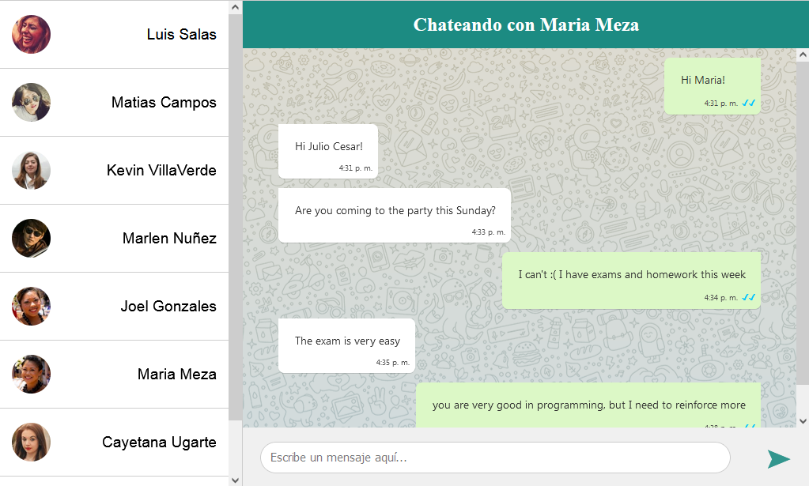
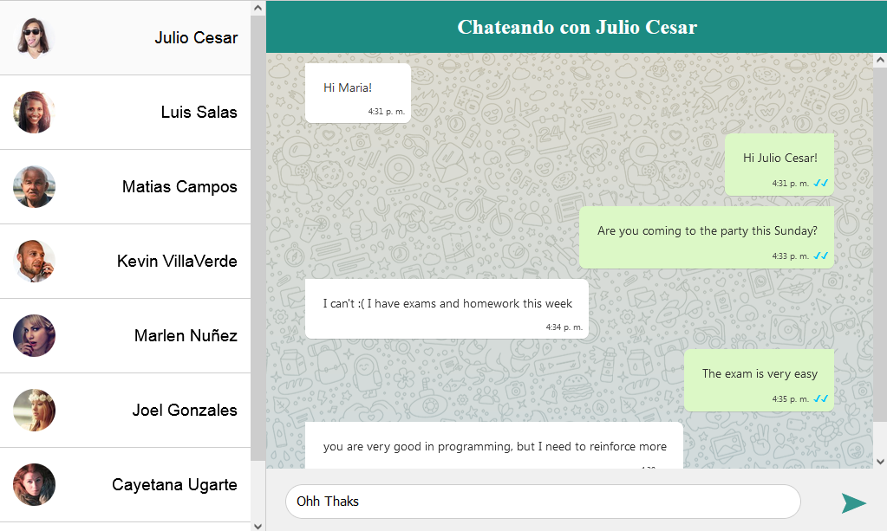

# WhatsApp Clone :telephone_receiver:

Tecnologías utilizadas:

- Node JS 12 & Express Framework
- Socket IO & EJS

---

Esta aplicación puede:

- **Listar los usuarios activos mediante su nickname**


- **Enviar y recibir mensajes privados de manera instantánea**





### Instalación

```sh
git clone https://github.com/juliogarciape/whatsapp-clone-node
cd whatsapp-clone-node
npm install
npm run dev # run in development mode
npm start # run in production mode
```

